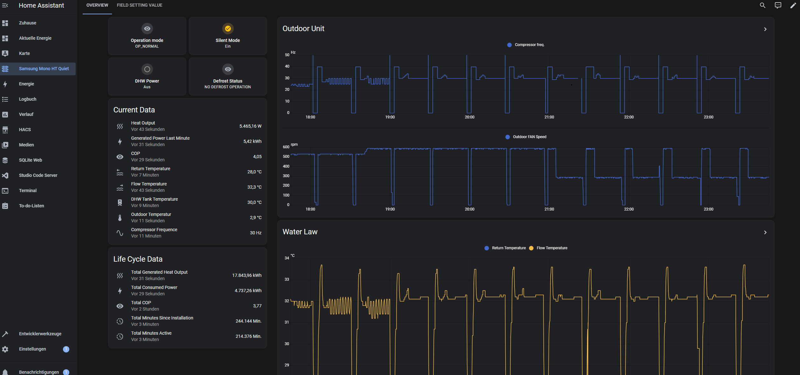
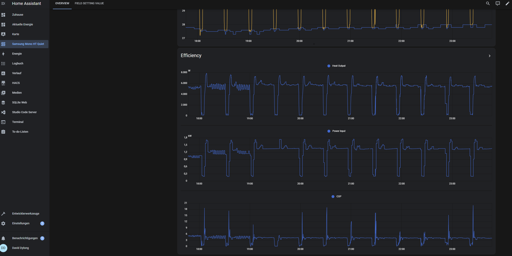
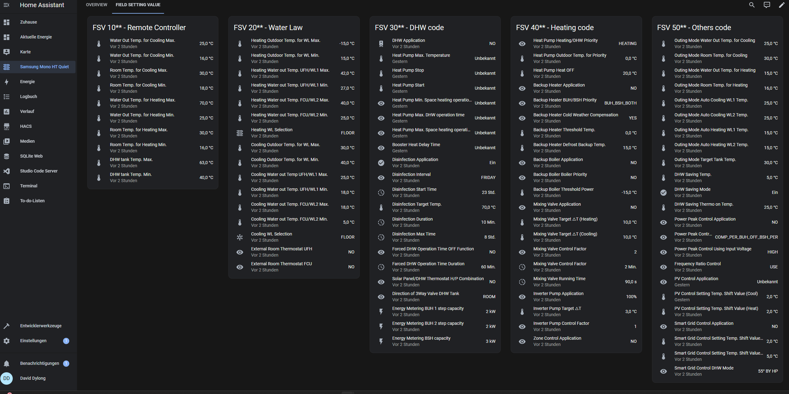
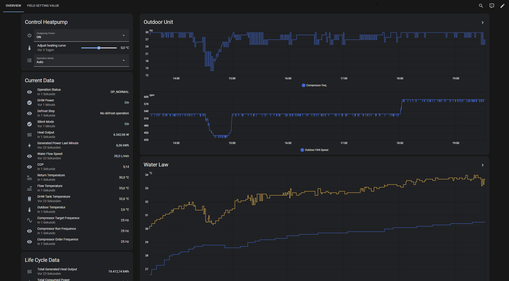
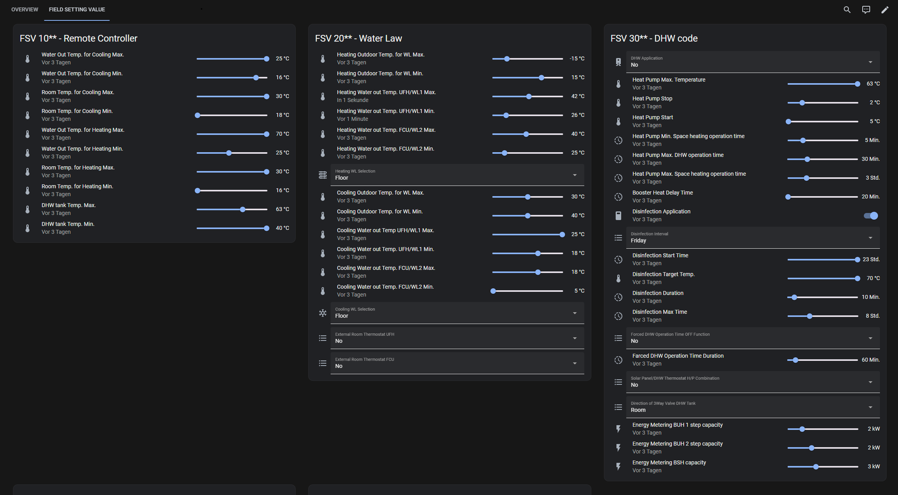
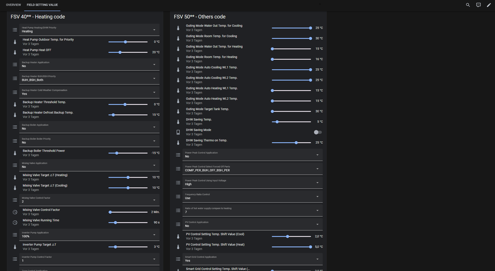

# EHS-Sentinel
EHS Sentinel written in python which reads Samsung EHS serial Data and published it to MQTT.
If want, you can activate the Home Assistent MQTT Auto Discovery Format, then the Messages will be sent in Home Assistent format.

There are already some solutions, but most of them are limited to just a few data points.
Since extending these was often too difficult, I have written a script here which lists almost all known data points of the Samsung EHS (source: https://wiki.myehs.eu/wiki/NASA_Protocol) in a YAML file as a repository `data/NasaRepository` and the entries there were supplemented by a few Relavante HomeAssistant attributes

In addition, a few data points are generated from others, such as COP and Heat Output.

# Prerequisites

You need an MQTT Broker.
For Homeassistant you need the MQTT Plugin there with enabled Auto Discovery with Discovery Topic Prefix and Birth-Messages on Discovery Topic Prefix with subtopic "status" with text "online".
EHS-Sentinel subscribes <hass_discovery_prefix>/status Topic and if it receive an "online", then it cleans his intern known-devices topic and send the Auto Discovery Config again for any Measurment for Home Assistant.

# Upgrade instructions

1. Stop EHS-Sentinel
2. *Optional* If you are using HASS: Delete the MQTT Device
3. git pull the new release or download and extract the release zip file
4. Look into Release Notes if there are some new configurations and check if you have to ajust your configfile
5. Start EHS-Sentinel (I recommend to use `--clean-known-devices` on the start so EHS-Sentinel will send Configuration messages for HASS Auto Discovery after every startup.)
6. *Optional* If you are using HASS: and not use the `--clean-known-devices` Parm on Startup, send a birthmessage manualy or restart the MQTT Adapter in HASS.

# Installation

## Simple

1. Just clone the repository
    `git clone https://github.com/echoDaveD/EHS-Sentinel`
2. Install the requierments
    `pip install -r requirements.txt`
3. Copy the `data/config.yml` and provide your Configuration
4. Start the Application:
    `python3 startEHSSentinel.py --configfile config.yml --clean-known-devices`

   I recommend to use `--clean-known-devices` on the start so EHS-Sentinel will send Configuration messages for HASS Autodiscovery after every startup.

## Systemd Service

1. Just clone the repository
    `git clone https://github.com/echoDaveD/EHS-Sentinel`
2. Install the requierments
    `pip install -r requirements.txt`
3. Copy the `data/config.yml` and provide your Configuration
4. Change to ehs-sentinel.service file as followed:

   `ExecStart = python3 <Path of the script you want to run>` <- provide here to path to your folder where startEHSSentinel.py is

   sample: `ExecStart = python3 /root/EHS-Sentinel/startEHSSentinel.py --configfile /root/EHS-Sentinel/config.yml --clean-known-devices`

   I recommend to use `--clean-known-devices` on the start so EHS-Sentinel will send Configuration messages for HASS Autodiscovery after every startup.`

5. Change your `config.yml` to absolut paths:
   `nasaRepositoryFile: /root/EHS-Sentinel/data/NasaRepository.yml`

6. Copy the service File to your systemd folder:
  `cp ehs-sentinel.service /etc/systemd/system`

7. Enable the new service
  `systemctl enable ehs-sentinel`

8. Reload deamon
  `systemctl daemon-reload`

9. Start the Service
  `systemctl start ehs-sentinel`

10. check if anything is fine 
  `systemctl status ehs-sentinel`

11. If your want to check the journal logs
  `journalctl | grep ehsSentinel`


## Venv Installation (recommendet)

In general, it is recommended to work with a virtual environment (venvs) in python to be independent of other projects.
Some Distributions like debian 12 dont allow to use system wide pip package installation, so you have to use venv.

1. Just clone the repository
    `git clone https://github.com/echoDaveD/EHS-Sentinel`

2. Install python venv
  `apt install python3.11-venv` <- modify your python verison here

3. Create Python venv
  `python3 -m venv EHS-Sentinel`

4. change diractory
   `cd EHS-Sentinel`

5. activate venv
  `source bin/activate`

6. Install the requierments
    `pip install -r requirements.txt`

7. Copy the `data/config.yml` and provide your Configuration

8. get path of venv python executable
  `which python3` <- copy the output

9. Change to ehs-sentinel.service file as followed:

   `ExecStart = <path to python3> <Path of the script you want to run>` <- provide here to path to your folder where startEHSSentinel.py is

   sample: `ExecStart = /root/EHS-Sentinel/bin/python3 /root/EHS-Sentinel/startEHSSentinel.py --configfile /root/EHS-Sentinel/config.yml --clean-known-devices`

   I recommend to use `--clean-known-devices` on the start so EHS-Sentinel will send Configuration messages for HASS Autodiscovery after every startup.

10. Change your `config.yml` to absolut paths:
   `nasaRepositoryFile: /root/EHS-Sentinel/data/NasaRepository.yml`

11. Deactivate venv
  `dactivate`

12. Copy the service File to your systemd folder:
  `cp ehs-sentinel.service /etc/systemd/system`

13. Enable the new service
  `systemctl enable ehs-sentinel`

14. Reload deamon
  `systemctl daemon-reload`

15. Start the Service
  `systemctl start ehs-sentinel`

16. check if anything is fine 
  `systemctl status ehs-sentinel`

17. If your want to check the journal logs
  `journalctl | grep ehsSentinel`


# Home Assistant Dashboard

There are two rudimentary dashboard templates for Homeassistant, 
Read Only [ressources/dashboard_readonly_template.yaml](ressources/dashboard_readonly_template.yaml)

Control mode [ressources/dashboard_controlmode_template.yaml](ressources/dashboard_controlmode_template.yaml)

If you have good ideas and want to extend this feel free to create an issue or pull request, thanks!

## Read Only Mode








## Control Mode








# Configuration

## Command-Line Arguments

The `EHSArguments` class handles command-line arguments for the EHS-Sentinel script. Below is a detailed explanation of each argument and its usage.

### Arguments

- **--configfile** (required)
  - Type: `str`
  - Description: Path to the configuration file.
  - Example: `--configfile config.yml`

- **--dumpfile** (optional)
  - Type: `str`
  - Description: File path for where the dump file should be written to or read from if the `--dryrun` flag is set.
  - Example: `--dumpfile dumpfile.txt`

- **--dryrun** (optional)
  - Type: `bool`
  - Description: Run the script in dry run mode. Data will be read from the dump file.
  - Example: `--dryrun`

- **--clean-known-devices** (optional)
  - Type: `bool`
  - Description: Cleans the known devices topic on startup. Relevant for Home Assistant Auto Discovery, this option forces to resend the Device Configuration Autodiscovery Messages.
  - Example: `--clean-known-devices`

- **-v, --verbose** (optional)
  - Type: `bool`
  - Description: Enable verbose mode.
  - Example: `-v` or `--verbose`

### Example Usage

To run the EHS-Sentinel script with the required configuration file and optional arguments, use the following command:

```sh
python3 startEHSSentinel.py --configfile config.yml --dumpfile dumpfile.txt --dryrun --clean-known-devices -v
```

## Configuration File: `config.yml`

The `config.yml` file contains configuration settings for the EHS-Sentinel project. This file is used to configure general settings, serial connection parameters, and MQTT broker details. Below is a detailed explanation of each section and its parameters.

### General Settings

- **nasaRepositoryFile**: Path to the NASA repository file.
  - Default: `data/NasaRepository.yml`
- **protocolFile**: Path to the protocol file. (not set in Sample config.yml)
  - Example: `prot.csv`
- **allowControl**: Allows EHS-Sentinel to Control the Heatpump. HASS Entities are writable, EHS-Sentinel listents to set Topic and write published values to th Modbus Interface.
  The Set Topic have following pattern: <topicPrefix>/entity/<NASA_NAME>/set  sample: ehsSentinel/ENUM_IN_SG_READY_MODE_STATE/set
  - Default: `False`

  > [!CAUTION]  
  > This functionality requires that EHS-Sentinel actively communicates with
  > the  Samsung EHS, so EHS-Sentinel intervenes here in the Modbus data 
  > traffic between the components (it sends its own messages). 
  > The activation of this functionality is exclusively at your own risk. 
  > I assume no liability for any damage caused.

### Logging Settings

- **deviceAdded**: Set to true will log when new device is added to known Devices (and discover to HASS).
  - Default: `True`
- **messageNotFound**: Set to true will log when a received message was not found in NasaRepository
  - Default: `False`
- **packetNotFromIndoorOutdoor**: Set to true will log when a message not from Indoor/Outdoor unit was received
  - Default: `False`
- **proccessedMessage**: set to true, prints out a summary of which massage was processed and its value
  - Default: `False`
- **pollerMessage**: set to true, prints out detailed poller NASAPackets
  - Default: `False`
- **controlMessage**: set to true, prints out detailed control Message NASAPackets
  - Default: `False`
- **invalidPacket**: set to true, prints out invalid packets like length not ok or end byte not 0x34...
  - Default: `False`

### Serial Connection Settings
cannot be defined with TCP parm...

- **device**: The serial device URL.
  - Example: `/dev/ttyUSB0`
- **baudrate**: The baud rate for the serial connection.
  - Example: `9600`

### TCP Settings
cannot be defined with SERIAL parm...

- **ip**: The ip of rs485 to ETH Adapter.
  - Example: `168.192.2.200`
- **port**: The port of rs485 to ETH Adapter.
  - Example: `4196`

### MQTT Broker Settings

- **broker-url**: The URL of the MQTT broker.
  - Example: `123.45.6.69`
- **broker-port**: The port number of the MQTT broker.
  - Example: `1883`
- **client-id**: The client ID to use when connecting to the MQTT broker.
  - Deafult: `EHS-Sentinel`
- **user**: The username for authenticating with the MQTT broker.
  - Example: `user`
- **password**: The password for authenticating with the MQTT broker.
  - Example: `bigBabaBubuPa$$word1`
- **homeAssistantAutoDiscoverTopic**: The topic prefix for Home Assistant auto-discovery. This Topicprefix must be the same as in Home Assistant MQTT Integration Settings
  - Example: `homeassistant`
- **useCamelCaseTopicNames**: Boolean flag to enable or disable the use of camel case for topic names.
  - Example: `True`
- **topicPrefix**: The prefix to use for MQTT topics. (Is used when homeassistant is not set or empty)
  - Example: `ehsSentinel`

### Poller Configuration
  > [!CAUTION]  
  > This functionality requires that EHS-Sentinel actively communicates with
  > the  Samsung EHS, so EHS-Sentinel intervenes here in the Modbus data 
  > traffic between the components (it sends its own messages). 
  > The activation of this functionality is exclusively at your own risk. 
  > I assume no liability for any damage caused.

Experience has shown that the write function (required for poller) only works with a rts486 to ETH adapter, with a USB adapter no value could be written successfully so far.

With the Poller Configuration, values can be actively polled cyclically from the Samsung. All FSV values are already predefined in the sample Config. The pollers only need to be enabled. 

The data points are defined in the groups section, the group is then enabled in the fetch_interval and the schedule is entered (10h, 10m, 10s are valid units).

- **fetch_interval**: The ip of rs485 to ETH Adapter.
  - Example: `168.192.2.200`

    ***name***: Name of the Group from groups section
    - Example: `fsv10xx`

    ***enabled***: True or False, true to enable this poller
    - Example: `True`

    ***schedule***: Time of often teh Values should be polled, be carefully do not poll to often. Valid units are `h` for hours, `m` for minutes and `s` for seconds
    - Example: `10h`

- **groups**: A list of groups, the with the Measurements to be polled, name can be freely assigned.
  - Example: `fsv10xx`

    ***fsv10xx***: A list wiht Measurements name, can be taken from the NASARepository

### Example Configuration

```yaml
general:
  nasaRepositoryFile: data/NasaRepository.yml
  allowControl: False
#  protocolFile: prot.csv
logging:
  deviceAdded: True
  messageNotFound: False
  packetNotFromIndoorOutdoor: False
  proccessedMessage: False
  pollerMessage: False
#serial:
#  device: /dev/ttyUSB0
#  baudrate: 9600
tcp:
  ip: 168.192.2.200
  port: 4196
mqtt:
  broker-url: 123.45.6.69
  broker-port: 1883
  client-id: EHS-Sentinel
  user: user
  password: bigBabaBubuPa$$word1
  homeAssistantAutoDiscoverTopic: "homeassistant"
  useCamelCaseTopicNames: True
  topicPrefix: ehsSentinel
polling:
  fetch_interval: 
    - name: fsv10xx
      enable: false
      schedule: 30m
  groups:
    fsv10xx:
      - VAR_IN_FSV_1011
      - VAR_IN_FSV_1012
```

# Debugging

If you want to debug the App or just play around or even make some Changes, you can use the Dumpfile mode to be independent of the serial port and your production system.

## Creating Dump Files

To generate a Dumpfile just start the App with the `--dumpfile` Argument an let it run for a few minutes. 5-10 minutes has proven to be a good amount of time.

`python3 startEHSSentinel.py --configfile config.yml --dumpfile dump.txt`

to abort the Script jost Keyinterrupt with strg+c.

## Using Dumpfile as Input (no Serial)

If you have generated an Dumpfile you can use this to run in drymode so, the EHS-Sentinel is reading your dumpfile instead of Serial Port.

`python3 startEHSSentinel.py --configfile config.yml --dumpfile dump.txt --dryrun`

### Additional Commands

if you want to see how many uniquie Messages have been collected in the Dumpfile, here some commands:

1. Run the Dumpfile generatation with activated protocol file in the Config file.
2. search unique measerments

    `sort -u -t, -k1,3 prot.csv > prot_uniq.csv`
3. count lines

    `wc -l prot_uniq.csv`


# Changelog

### v1.0.0 - 2025-03-13
- EHS-Sentinel has been heavily modified to incorporate the control mechanism
- The read-in behavior of the modbus registers has been revised from chunks to single byte
- MessageProcessor now runs asynchronously
- MessageProducer added which takes over the writing communication with the WP
- Configuration of HASS entities has moved from hardcoded to NASA Repository
- NASA Repository has been fundamentally changed
  - All FSV Values, NASA_POWER, VAR_IN_TEMP_WATER_LAW_TARGET_F, NASA_INDOOR_OPMODE are allowed for writing mode
  - NASA_OUTDOOR_DEFROST_STEP DEFROST STEP 10 (b'0xa') added
  - ENUM_IN_SG_READY_MODE_STATE ACTIVE (b'0x2') added
- New configuration point allowControl to allow control of the Samsung EHS heat pump (deactivated by default).

  > [!CAUTION]  
  > This functionality requires that EHS-Sentinel actively communicates with
  > the  Samsung EHS, so EHS-Sentinel intervenes here in the Modbus data 
  > traffic between the components (it sends its own messages). 
  > The activation of this functionality is exclusively at your own risk. 
  > I assume no liability for any damage caused.

- new configuration points in logging
  - controlMessage (default False) to print out the controlled mesagges
  - invalidPacket (default False) prints out invalid messages (length not ok, x34 not at end...)
- Dashboard template has been split, [ressources/dashboard_readonly_template.yaml](ressources/dashboard_readonly_template.yaml) is for readonly mode and the [ressources/dashboard_controlmode_template.yaml](ressources/dashboard_controlmode_template.yaml) for control mode

### v0.3.0 - 2025-02-27
- Added poller functionality. EHS-Sentinel can now actively request values via Modbus
  - fetch_intervals and groups can be defined in the config file
  - default group and pollers are in the sampelconfig

  > [!CAUTION]  
  > This functionality requires that EHS-Sentinel actively communicates with
  > the  Samsung EHS, so EHS-Sentinel intervenes here in the Modbus data 
  > traffic between the components (it sends its own messages). 
  > The activation of this functionality is exclusively at your own risk. 
  > I assume no liability for any damage caused.

- added a homeassistant dashboard.yaml with default Dashboard
- edited Measurement
  - ENUM_IN_FSV_5061 add enums
  - ENUM_IN_FSV_5094 correct enum values
  - ENUM_IN_PV_CONTACT_STATE correct enum values
  - added units for multiple Measurements
- Rename some Measurements:
  - NASA_INDOOR_COOL_MAX_SETTEMP_WATEROUT -> VAR_IN_FSV_1011
  - NASA_INDOOR_COOL_MIN_SETTEMP_WATEROUT -> VAR_IN_FSV_1012
  - NASA_INDOOR_COOL_MAX_SETTEMP_ROOM -> VAR_IN_FSV_1021
  - NASA_INDOOR_COOL_MIN_SETTEMP_ROOM -> VAR_IN_FSV_1022
  - NASA_INDOOR_HEAT_MAX_SETTEMP_WATEROUT -> VAR_IN_FSV_1031
  - NASA_INDOOR_HEAT_MIN_SETTEMP_WATEROUT -> VAR_IN_FSV_1032
  - NASA_INDOOR_HEAT_MAX_SETTEMP_ROOM -> VAR_IN_FSV_1041
  - NASA_INDOOR_HEAT_MIN_SETTEMP_ROOM -> VAR_IN_FSV_1042
  - NASA_DHW_MAX_SETTEMPLIMIT -> VAR_IN_FSV_1051
  - NASA_DHW_MIN_SETTEMPLIMIT -> VAR_IN_FSV_1052
  - NASA_USE_DHW_THERMOSTAT -> ENUM_IN_FSV_3061
  - NASA_USE_BOOSTER_HEATER -> ENUM_IN_FSV_3031
  - NASA_ENABLE_DHW -> ENUM_IN_FSV_3011
  - NASA_USE_THERMOSTAT!1 -> ENUM_IN_FSV_2091
  - NASA_USE_THERMOSTAT2 -> ENUM_IN_FSV_2092

### v0.2.2 - 2025-02-24
- Support for rs485 to ETH Adapter, tcp options instead of serial port are possible now

### v0.2.1 - 2025-02-22
- limit NASA_EHSSENTINEL_COP and NASA_EHSSENTINEL_TOTAL_COP to values between 0 and 20 

### v0.2.0 - 2025-02-22
- improved MQTT Auto Discovery Config Messages 
- NASAPacket and NASAMessage are now bidirectional, can decode and encode Packets
- Improved data quality
  - Added crc16 Checksum check for any Packet to reduce incorrect value changes 
  - Only Packets from outdoor/Indoor Units are processed
- Following warnings moved to SkipInvalidPacketException and from warning to debug log level to reduce log entries
  - Source Adress Class out of enum
  - Destination Adress Class out of enum
  - Checksum for package could not be validatet calculated
  - Message with structure type must have capacity of 1.
- removed silentNode config property (new logging section is replacing its functionality but more granular)
- added new logging config property to allow to turn on/off additional info log entries
  - deviceAdded set to true (default) will log when new device is added to known Devices (and discover to HASS)
  - messageNotFound set to true (false is default) will log when a received message was not found in NasaRepository
  - packetNotFromIndoorOutdoor set to true (false is default) will log when a message not from Indoor/Outdoor unit was received
  - proccessedMessage set to true(false is default) prints out a summary of which massage was processed and its value
- NASA_EHSSENTINEL_HEAT_OUTPUT limited to values between 0 and 15000 to reduce false values between temp statsu changes
- Added new Measurements
  - 0x4423 LVAR_IN_MINUTES_SINCE_INSTALLATION 
  - 0x4424 LVAR_IN_MINUTES_ACTIVE
  - 0x4426 LVAR_IN_GENERATED_POWER_LAST_MINUTE
  - 0x4427 LVAR_IN_TOTAL_GENERATED_POWER
  - 0x0997 NASA_EHSSENTINEL_TOTAL_COP = LVAR_IN_TOTAL_GENERATED_POWER / NASA_OUTDOOR_CONTROL_WATTMETER_ALL_UNIT_ACCUM
- NASA Repository, measurements enums completed
  - ENUM_IN_FSV_3041: enum edited
  - ENUM_IN_FSV_3071: enum edited
  - ENUM_IN_FSV_4021: enum edited
  - ENUM_IN_FSV_4041: enum edited
  - ENUM_IN_FSV_4051: enum edited
  - ENUM_IN_FSV_4053: enum edited
  - ENUM_IN_FSV_5022: enum edited
  - ENUM_IN_FSV_5042: enum edited
  - ENUM_IN_FSV_5081: enum edited
  - ENUM_IN_FSV_5091: enum edited
  - ENUM_IN_FSV_2093: enum edited
  - ENUM_IN_FSV_2094: enum edited
  - VAR_IN_FSV_2011: desc edited
  - VAR_IN_FSV_2012: desc edited
  - VAR_IN_FSV_2021: desc edited
  - VAR_IN_FSV_2022: desc edited
  - VAR_IN_FSV_2031: desc edited
  - VAR_IN_FSV_2032: desc edited
  - ENUM_IN_FSV_2041: desc edited
  - VAR_IN_FSV_2051: desc edited
  - VAR_IN_FSV_2052: desc edited
  - VAR_IN_FSV_2061: desc edited
  - VAR_IN_FSV_2062: desc edited
  - VAR_IN_FSV_2071: desc edited
  - VAR_IN_FSV_2072: desc edited
  - ENUM_IN_FSV_2093: desc edited
  - VAR_IN_FSV_3021: desc edited
  - VAR_IN_FSV_3022: desc edited
  - VAR_IN_FSV_3023: desc edited
  - VAR_IN_FSV_3024: desc edited
  - VAR_IN_FSV_3025: desc edited
  - VAR_IN_FSV_3026: desc edited
  - VAR_IN_FSV_3032: desc edited
  - VAR_IN_FSV_3033: desc edited
  - VAR_IN_FSV_3041: desc edited
  - VAR_IN_FSV_3042: desc edited
  - VAR_IN_FSV_3043: desc edited
  - VAR_IN_FSV_3044: desc edited
  - VAR_IN_FSV_3045: desc edited
  - VAR_IN_FSV_3046: desc edited
  - ENUM_IN_FSV_3051: desc edited
  - ENUM_IN_FSV_3052: desc edited
  - ENUM_IN_FSV_3071: desc edited
  - ENUM_IN_FSV_3081: desc edited
  - ENUM_IN_FSV_3082: desc edited
  - ENUM_IN_FSV_3083: desc edited
  - VAR_IN_FSV_4011: desc edited
  - VAR_IN_FSV_4012: desc edited
  - VAR_IN_FSV_4013: desc edited
  - VAR_IN_FSV_4021: desc edited
  - VAR_IN_FSV_4022: desc edited
  - VAR_IN_FSV_4023: desc edited
  - VAR_IN_FSV_4024: desc edited
  - VAR_IN_FSV_4025: desc edited
  - VAR_IN_FSV_4031: desc edited
  - VAR_IN_FSV_4032: desc edited
  - VAR_IN_FSV_4033: desc edited
  - VAR_IN_FSV_4041: desc edited
  - VAR_IN_FSV_4042: desc edited
  - VAR_IN_FSV_4043: desc edited
  - VAR_IN_FSV_4044: desc edited
  - VAR_IN_FSV_4045: desc edited
  - VAR_IN_FSV_4046: desc edited
  - VAR_IN_FSV_4051: desc edited
  - VAR_IN_FSV_4052: desc edited
  - VAR_IN_FSV_4053: desc edited
  - VAR_IN_FSV_4061: desc edited
  - VAR_IN_FSV_5011: desc edited
  - VAR_IN_FSV_5012: desc edited
  - VAR_IN_FSV_5013: desc edited
  - VAR_IN_FSV_5014: desc edited
  - VAR_IN_FSV_5015: desc edited
  - VAR_IN_FSV_5016: desc edited
  - VAR_IN_FSV_5017: desc edited
  - VAR_IN_FSV_5018: desc edited
  - VAR_IN_FSV_5019: desc edited
  - VAR_IN_FSV_5021: desc edited
  - VAR_IN_FSV_5023: desc edited
  - ENUM_IN_FSV_5022: desc edited
  - ENUM_IN_FSV_5041: desc edited
  - ENUM_IN_FSV_5042: desc edited
  - ENUM_IN_FSV_5043: desc edited
  - ENUM_IN_FSV_5051: desc edited
  - VAR_IN_FSV_5083: desc edited
  - VAR_IN_FSV_5082: desc edited
  - ENUM_IN_FSV_5081: desc edited
  - ENUM_IN_FSV_5091: desc edited
  - ENUM_IN_FSV_5094: desc edited
  - VAR_IN_FSV_5092: desc edited
  - VAR_IN_FSV_5093: desc edited

### v0.1.0Beta - 2025-02-08
- Initial Commit
